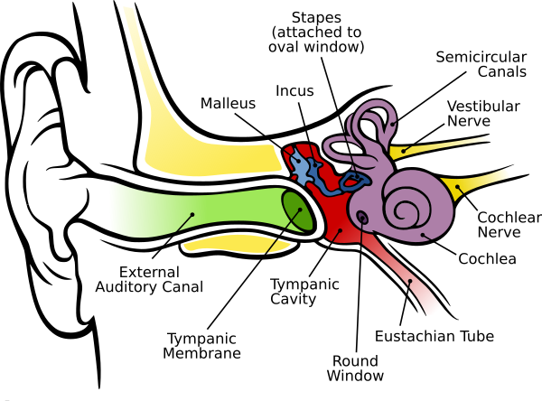
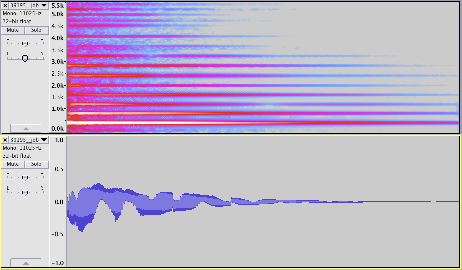
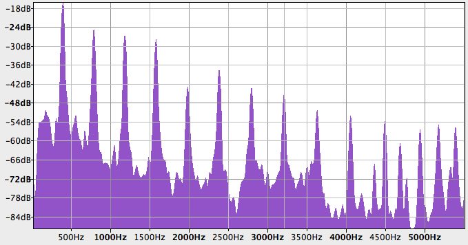
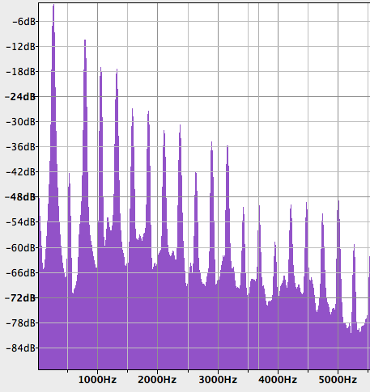
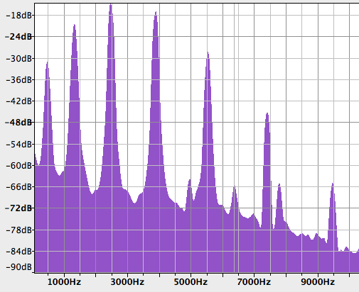
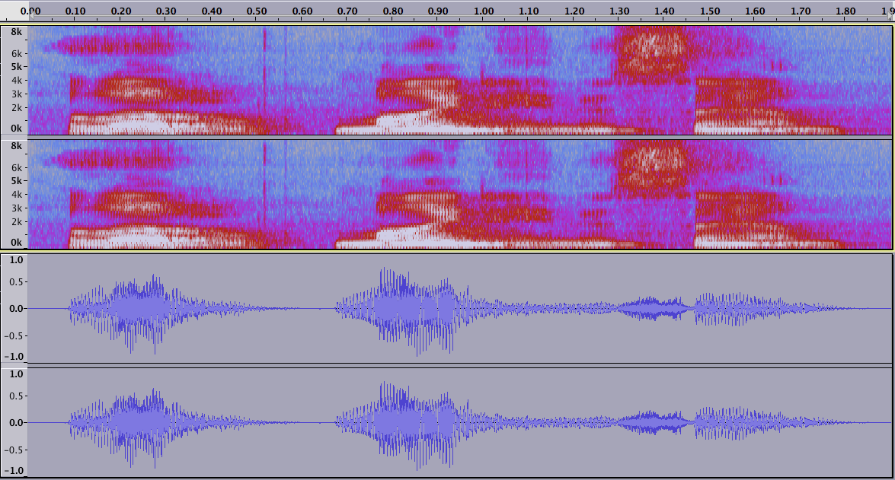

# LESSON 2: ELEMENTS OF SOUND
 
What is sound?

### Objects in this lesson

*key*, *line~*, *kslider*, *\*~*, *+~*, *message*

## Sound
First thing to talk about is Sound. As we all know, sound is vibrations in the air. When something in the world starts to vibrate, it pushes the air around it. That air pushes more air and this generates a sound wave.

I always think it's weird that there are bones in the ear, like why bother? But they actually serve a very useful purpose. For one, muscles attached to the ear can adjust the dynamic range of the ear. Also, they transduce vibrations from the air to the fluid inside the cochlea. This transition from one medium to another requires impedence matching.

While the ear is specially designed to detect vibrations in the air, its purpose is to understand the state of things in the world. Vibration is a means to an end. This relationship between the physical phenomenon and the psychic phenomenon or percept, is something that we’ll encounter over and over again while working with Max. Because in Max we’ll often be working with very small, very elemental components, like individual samples for example. When we assemble these fundamental components into a musical construction, we’ll find that we have to keep in mind simultaneously these two domains. On the one hand, we’ll be concerned with questions of aesthetics and perception, asking ourselves how vibrations and samples impact us cognitively to build a musical impression. On the other hand, we’ll attend to the physical and mathematical dimension, focusing on how the atoms that we’re working with vibrate together. 

- Play rice is often served in round bowls.

## Sine tones

Cool, so, yesterday we played a sine tone using [cycle~], and we attenuated it by using a gain~ object. We talked a little bit about the fact that you can also attenuate the signal by multiplying it by a number, but the only numbers we used were zero and one. But you can use any number, provided you aren't afraid of clipping.

Why do we care so much about sine tones in the first place? It's because at some level _all_ sounds can be represented as the sum of sine tones.
 
What happens if we try to play two sine tones at the same time? Let’s put both at relatively low intensity and play them together.

- Show how to make two sine tones, where one must play at some frequency multiple of the other. Talk about harmonic versus inharmonic frequency relationships.
 
- At the same frequency we only hear a single tone, even if the two tones aren't in phase.
- If one tone is double the frequency of the other, then depending on the relative amplitude of the two tones we can hear one tone or two.
- If one tone is 1.5 times the frequency of the other, then the second tone must be even quieter to blend.
- At 1.84 times the frequency, the second tone has to be very quiet indeed to sound as if it's part of the root tone.
- If the second tone is 1Hz different from the other tone, then we hear beating.

## Real world sounds

In real world sounds, these sine tones, their relative strengths and weaknesses are hugely important. When we talk about what makes sounds _sound_ the way they do, we're often talking about timbre. The feeling of a piano is very different from the feeling of a violin, is very different from a bell, is very different from a glass falling off a table.

- This is a piano sound. Note the evenly spaced (aka harmonic) overtones.

- This is a clarinet. Notice the _very_ weak first overtone (aka second partial). This is very characteristic of a clarinet sound.

- This is a bell plot. Notice that the partials are not harmonically spaced. This is called an inharmonic spectrum, and it's very characteristic of bell sounds.

- This is a recording of me saying "Hello, my name is Sam." Notice _especially_ the last word "Sam," where the very noisy "s" sound gives way to the very tonal "am" sound.

## Beating
 
As we start to drag the two sine waves apart from each other, something interesting starts to happen. Once we get to around 20Hz apart, we hear this warbling that dissolves into dissonance. Of course, we’re at that very exciting, very sexy time <-> frequency boundary. Basically, things with a frequency below 20 Hz or 20 events per second sound like just that—a stream of events. Things above that frequency sound like just that—a frequency or pitch. But in the middle we get this whole fun messy place that we can really sink our toes into with Max.
 
## Envelopes

So timbre. We talked about harmonic sounds, and the relative strength of partials in these sounds. But in real world sounds, the loudness of the sound changes over time. In fact, each partial can even have its own envelope. A piano, for example, has a much faster _attack_ then a violin, where an attack describes the speed with which the sound goes from zero to max amplitude.
 
Another name for an envelope is a ramp, or a slow, continuous change. The linear ramp generator object in Max is called [line~]. The line~ object takes one argument which is its initial amplitude. It receives messages in its left inlet in two parts: destination plus time to destination. We can use a [message] object to store these messages. [1 20] is interpreted by line~ as “ramp to the value 1 over the course of 20 milliseconds”.
 
We can use the [scope~] object to see the output of [line~] as well, since after all it’s just a signal. Since it’s a number, it’s also useful to use [number~] to monitor the output. A word of warning, number~ doesn’t pass values through, like its control-valued cousin, flonum.
 
### B R E A K
 
Okay, let's look at how to make an additive synthesizer. First we'll just use one [cycle~] plus [line~]. Next we'll use two. Then we can look at how to keep them in a harmonic relationship. Then we'll move up to four.

- Show how to use the [key] object to generate a midi-esque note.

## Recording assignment

Extend this patch and use it to generate another 30 second piece. Only rule is: you have to use [mousestate] in some way. Things you could play with:

- What are different ways you can make the sound inharmonic?
- Using multiple scale objects, can you effect relative changes in the balance of the partials using mousestate?
- Can you involve metro in some way? You don't have to trigger all the [cycle~] objects at the same time...
- Are there creative ways to exploit beating?
